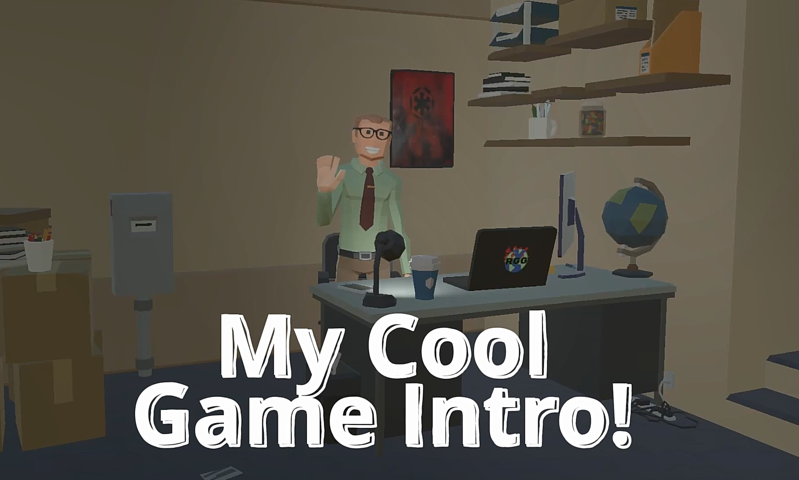
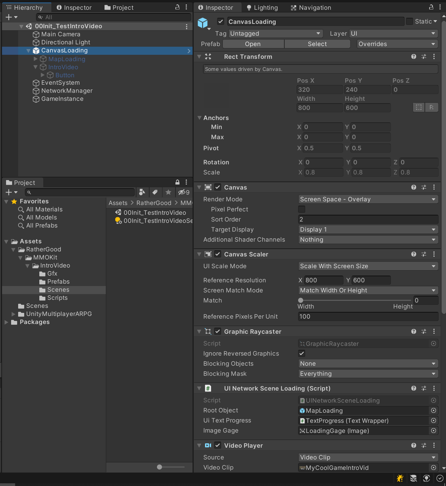

# Intro Video Demo mod for MMORPG Kit

**Demo Video**

**Author:** RatherGood1

**Version**: 0.2

Version 0.2 adds CLIENT_BUILD to only run video on client side.  Add to Project settings-> Script compilation -> Script define symbols "CLIENT_BUILD" or server build will fail. 

**Updated:** 27 Oct 21

**Compatibility: (tested on) Suriyun** **MMORPG Kit Version 1.70f**

**Description:** Plays Demo video after Init screen loads before Home screen loads. Your GameInstance.cs will call "public Coroutine LoadScene(string sceneName)" that in turn will call the Coroutine LoadSceneRoutine. This script will intercept the call only when (sceneName == GameInstance.Singleton.HomeSceneName).

You could extend this script for other finctionality you want to capture on scene loads.

Side note: 
For your actual game scenes, the NetworkManager game Object handles those events that you can also capture/listen for to extend game scene loading. 

**Other Dependencies:**

You need to provide your own intro video to replace sample.

A camera is needed in the scene.

**Core MMORPG Kit modifications:**

Need to modify script: "UISceneLoading" to add "protected virtual" to 

"protected override IEnumerator LoadSceneRoutine(string sceneName)"

**Instructions for use:**

On your 00Init scene (or whatever Init scene you are using in your game) Replace the "CanvasLoading" GameObject with CanvasLoading sample provided. Alternatively follow the structure form the example "00Init_TestIntroVideo.scene" structure. Configure the video settings.  

The video is played on a UI texture that you can add more overlays on top of as desired.

**Hierarchy structure**

See Unity Video Player documentation to see how to set this up. Beyond the scope here to explain how that works.

 https://docs.unity3d.com/ScriptReference/Video.VideoPlayer.html

 
**Done.**

